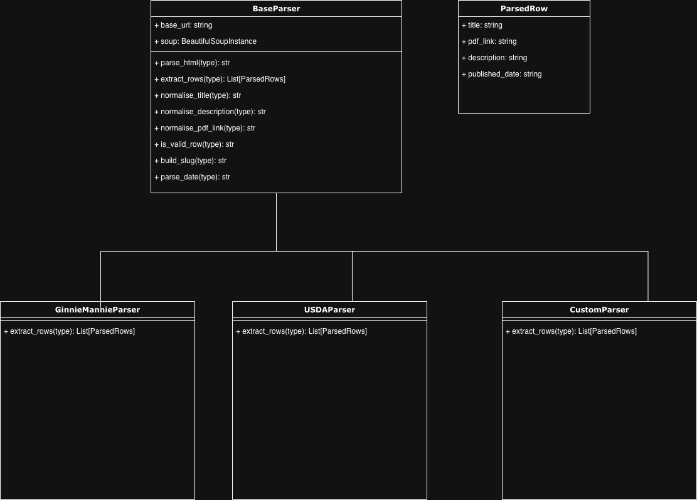
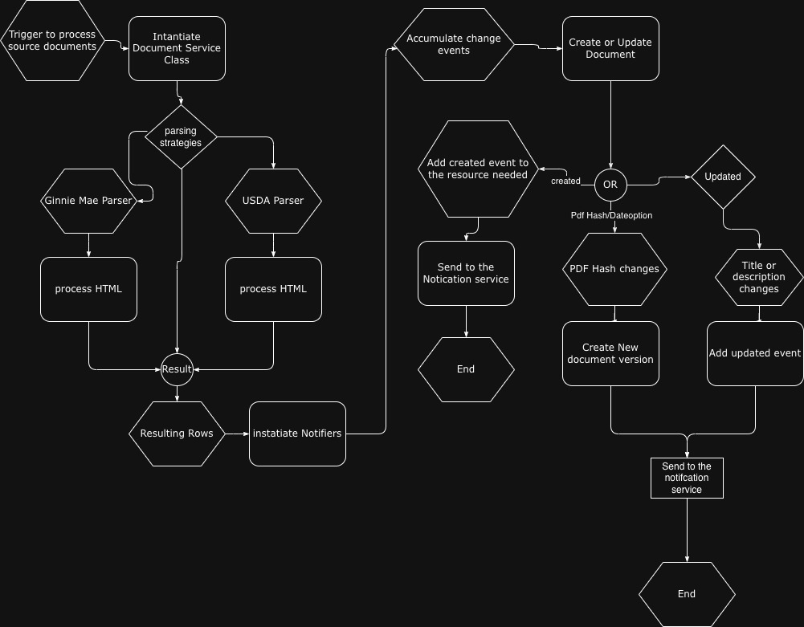

# Guide Change Tracker – Presentation

## 1. Overview
This presentation summarizes the system architecture and implementation for the **Government Guide Change Tracker**, covering:

- Database Model & the reason for the unique slugs  
- Parser workflow and parser types  
- How the `GinnieMaeParser` works  
- Fallback selector logic  
- `DocumentSourceService` workflow  
- Notification system  
- Celery scheduled tasks: frequency, purpose, and notifier integration

---

# 2. Database Model


## 2.1 ParserType
Represents the kind of Parser to be used to retrieve the HTML documents (e.g., ginnie-mae, usda).

**Fields:**
- `slug`
- `name`
- `active`

**Purpose:**
- Provides the bases for the strategy pattern in use.
- Allows users to add new parser type for different kind of parsing for the website source.

## 2.2 DocumentSource
Represents a government program guide origin (e.g., Ginnie Mae, USDA).

**Fields:**
- `name`
- `index_url`
- `parser_type`
- `active`

**Purpose:**
- Abstracts each government site into a single configuration.
- Allows multiple sources with different HTML structures.
- Enables unified nightly/daily/interval processing.

---

## 2.3 Document
Represents a *stable logical document*, such as “MBS Guide Chapter 03”.

**Fields:**
- `slug`
- `title`
- `description`
- `source` (FK → DocumentSource)
- `current_version` (FK → DocumentVersion)

**Constraints:**
- Unique constraints with `source` name and `slug`


### Why a Unique `slug` and `source`?
- PDF names and URLs change frequently. Titles may contain additional text or formatting.
- It helps to check the new version of updated document.

A **slug** conjoined with **source** is:
- Deterministic
- Stable across versions
- Generated from canonical parts of the title  
  (e.g., extracting *chapter numbers* or running `slugify(title, description)`)

This allows:
- Version tracking across updates
- Preventing duplicates
- Supporting sites with inconsistent titles
- Supproting sites(like USDA) with the same titles but different description

---

## 2.4 DocumentVersion
Stores **every version ever seen** of a PDF.

**Fields:**
- `pdf_url`
- `published_date` (nullable)
- `pdf_hash` (unique per Document)
- `fetched_at`

**Why Use PDF Hashing?**
- Published date may be missing or incorrect.
- URLs may not change even when PDF content does.
- A content hash guarantees *actual changes* are detected.

---

# 3. Parser Workflow


## 3.1 Purpose of Parsers
Each site(source) has different HTML structure. Parsers:

- Fetch and parse HTML of the index page
- Extract rows → PDF URL, title, description, date
- Normalize them into `ParsedRow` objects
- Provide fallback strategies for inconsistent pages

---

## 3.2 Parser Type
Every `DocumentSource` has a `parser_type`, e.g.:

- `"ginnie_mae"`
- `"usda"`
- `"custom"`
- etc.

`parser_type` selects the correct parsing strategy through a registry.

```python
def get_parser(parser_slug: str, base_url: str) -> BaseParser:
    """
    Factory function to get the appropriate parser based on slug.
    Uses strategy pattern.
    """
    parsers = {
        'ginnie-mae': GinnieMaeParser,
        'usda': USDAParser,
        'custom': CustomParser,
    }
    
    parser_class = parsers.get(parser_slug, CustomParser)
    return parser_class(base_url)
```
## 3.2 BaseParser
### 3.2.1 Flow
1. Parses the html from the request that is gotten from the service.
2. Do the house keeping formatting like normalizing the title, pdf links, slug,descrption, and also ensure that date is parsed correctly.
3. Create the abstract class from the extracton of rows into the `ParsedDocumentRow` dataclass.

---

## 3.3 GinnieMaeParser

### 3.3.1 Workflow
1. Load HTML using BeautifulSoup.
2. Find the table containing PDF entries.
3. Extract:
   - First `<a>` tag with `.pdf`
   - get the title from the `<a>` tag text
   - Description from sibling columns
   - Published date from the last column.
   sample code
   ```python
       def extract_rows(self, html: str) -> List[ParsedDocumentRow]:
        """Extract rows from Ginnie Mae MBS Guide Library HTML."""
        soup = self.parse_html(html)
        rows = []
        
        # Strategy 1: Try to find table with PDF links
        table = self._find_table_with_pdfs(soup)
        
        if table:
            rows.extend(self._extract_from_table(table))

        # Strategy 2: Fallback - find all PDF links directly (heuristic approach)
        if not rows:
            rows.extend(self._extract_from_pdf_links(soup))
        
        return rows

        ----
    def _extract_title(self, link_tag: BeautifulSoup, cells: List, tr: BeautifulSoup) -> Optional[str]:
        """Extract title using multiple strategies - doesn't depend on th tags."""
        # Strategy 1: Link text (most reliable)
        print(cells[1].get_text(strip=True), 'cells')
        title = link_tag.get_text(strip=True)
        print(cells[1].get_text(strip=True), 'cells', title)

        if title:
            return title
        
        # Strategy 2: First non-empty cell text (excluding th header cells)
        for cell in cells:
            if cell.name == 'th':
                continue
            cell_text = cell.get_text(strip=True)
            if cell_text and not re.match(r'^\d{1,2}[/-]\d{1,2}[/-]\d{2,4}$', cell_text):  # Not a date
                return cell_text
        
        # Strategy 3: Parent element text (removing link text)
        parent = link_tag.find_parent(['td', 'th', 'div', 'li'])
        if parent:
            # Get all text, remove the link text
            full_text = parent.get_text(separator=' ', strip=True)
            link_text = link_tag.get_text(strip=True)
            if full_text and full_text != link_text:
                # Remove link text from full text
                title = full_text.replace(link_text, '').strip()
                if title:
                    return title
        
        # Strategy 4: Row text (first meaningful text)
        row_text = tr.get_text(separator=' ', strip=True)
        if row_text:
            # Split by common separators and take first meaningful part
            parts = re.split(r'\s{2,}|\t|\n', row_text)
            for part in parts:
                part = part.strip()
                if part and len(part) > 3 and not re.match(r'^\d{1,2}[/-]\d{1,2}[/-]\d{2,4}$', part):
                    return part
        
        return None
    ---
    def _extract_published_date(self, cells: List, tr: BeautifulSoup) -> Optional[datetime.date]:
        """Extract published date using multiple strategies. Missing date is allowed."""
        # Strategy 1: Last cell (common pattern: title, description, date)
        if cells:
            for cell in reversed(cells):
                if cell.name == 'th':
                    continue
                date_text = cell.get_text(strip=True)
                if date_text:
                    date = self.parse_date(date_text)
                    if date:
                        return date
        
        # Strategy 2: Look for date patterns in row text
        row_text = tr.get_text(strip=True)
        date_match = re.search(r'\d{1,2}[/-]\d{1,2}[/-]\d{2,4}', row_text)
        if date_match:
            date = self.parse_date(date_match.group())
            if date:
                return date
        
        # Missing published date is allowed - will fall back to PDF hash comparison
        return None
   ```
4. Normalize fields from the base class

### 3.3.2 Fallback Selectors
Because government pages change:

- If a `<table>` is missing and row structure changes → search for `a[href$=".pdf"]` anywhere in row
- If date cell missing → try regex from text

These fallbacks ensure robust scraping even after layout updates.

## 3.4 USDAParser

### 3.4.1 Workflow
1. Load HTML using BeautifulSoup.
2. Find the div with `'div[class*="view-content"]'`, that as `<a>` tag pointing to pdf.
3. Extract:
   - First `<a>` tag with `.pdf`
   - get the title from the `<a>` tag text
   - Description from sibling columns specfically `<p>` tag.
   - Ignore the published date, mostly since it doesn't come with it.
sample code:
```python
    def extract_rows(self, html: str) -> List[ParsedDocumentRow]:
        soup = self.parse_html(html)
        rows = []
        div = self._find_table_div_pdfs(soup)

        if div:
            rows.extend(self._extract_from_div(div))

        
        return rows
```
4. Normalize fields with base class.

### 3.4 Fallback Selectors
Because government pages change:

- If a `<div>` is missing and row structure changes → search for `a[href$=".pdf"]` anywhere in row
- If date cell missing → try regex from text

These fallbacks ensure robust scraping even after layout updates.

---

# 4. DocumentSourceService

This is the heart of the implmentation:


This service orchestrates the full lifecycle for **each** source:

### Workflow
1. Fetch index page HTML
  ```python
  def fetch_index_page(self) -> str:
        """
        Fetch the index page HTML from the document source.
        
        Returns:
            HTML content as string
            
        Raises:
            DocumentFetchError: If fetching fails
        """
        try:
            response = requests.get(
                self.source.index_url,
                timeout=100,
                headers={
                    'User-Agent': 'Mozilla/5.0 (compatible; DocumentTracker/1.0)'
                }
            )
            response.raise_for_status()
            return response.text
        except requests.RequestException as e:
            logger.error(f"Failed to fetch index page for {self.source.name}: {e}")
            raise DocumentFetchError(f"Failed to fetch index page: {e}") from e
  ``` 
2. Parse rows via parser
 ```python
 def parse_documents(self, html: str) -> List[ParsedDocumentRow]:
        """
        Parse HTML to extract document rows.
        
        Args:
            html: HTML content to parse
            
        Returns:
            List of parsed document rows
        """
        try:
            rows = self.parser.extract_rows(html)
            logger.info(f"Parsed {len(rows)} documents from {self.source.name}")
            return rows
        except Exception as e:
            logger.error(f"Failed to parse documents for {self.source.name}: {e}")
            raise DocumentFetchError(f"Failed to parse documents: {e}") from e
 ```
3. For each row:
   - Generate slug
   - Get or create Document
   - Decide whether PDF must be downloaded:
     - Rule A: Always compare published date first
     - Rule B: If published date unchanged → maybe skip
     - Rule C: If published date missing and the option to fetch hash was chosen → ALWAYS hash
4. Download PDF (if needed)
5. Compute hash and compare with latest version (here is sample of change detection logic)
    ```python
    # Process each row
    for row in parsed_rows:
        try:
            normalized = self.normalize_row(row)

            # ----------------------------------------------
            # 1. Get or create document
            # ----------------------------------------------
            document, created = Document.objects.get_or_create(
                source=self.source,
                slug=normalized['slug'],
                defaults={
                    'title': normalized['title'],
                    'description': normalized['description'],
                }
            )

            if created:
                results['documents_created'] += 1
            else:
                # ----------------------------------------------
                # Update title/description if needed
                # ----------------------------------------------
                updated = False
                updated_fields = []

                if document.title != normalized['title']:
                    document.title = normalized['title']
                    updated = True
                    updated_fields.append('title')

                if document.description != normalized['description']:
                    document.description = normalized['description']
                    updated = True
                    updated_fields.append('description')

                if updated:
                    document.save()
                    results['documents_updated'] += 1
                    self.change_events.append(ChangeEvent(
                        document=document,
                        event_type='updated_document',
                        change_reason=", ".join(updated_fields)
                    ))

            previous_version = document.current_version
            published_date = normalized['published_date']

            # ---------------------------------------------------
            # 2. Apply the required rules:
            #    Rule A: Always compare published date first
            #    Rule B: If published date unchanged → maybe skip
            #    Rule C: If published date missing → ALWAYS hash
            # ---------------------------------------------------

            # ---------------------------------------------------
            # CASE 1 — Published date exists
            # ---------------------------------------------------
            if published_date:

                # A: Try to find an existing version matching this date
                existing_by_date = DocumentVersion.objects.filter(
                    document=document,
                    published_date=published_date
                ).first()

                if existing_by_date:
                    # Published date unchanged → No need to hash for now
                    continue

                # Published date changed → need to confirm via hash if enabled
                pdf_hash = None
                if fetch_pdfs:
                    pdf_hash = self.fetch_pdf_hash(normalized['pdf_link'])

                # If we have a hash, check for duplicate version
                existing_by_hash = None
                if pdf_hash:
                    existing_by_hash = DocumentVersion.objects.filter(
                        document=document,
                        pdf_hash=pdf_hash
                    ).first()

                # If existing version has the same PDF hash → nothing changed
                if existing_by_hash:
                    continue

                # Create a new version
                new_version = DocumentVersion.objects.create(
                    document=document,
                    pdf_url=normalized['pdf_link'],
                    published_date=published_date,
                    pdf_hash=pdf_hash or '',
                    fetched_at=timezone.now()
                )
                results['versions_created'] += 1

                # Determine change reason
                if not previous_version or not previous_version.published_date:
                    change_reason = "published_date_added"
                elif published_date > previous_version.published_date:
                    change_reason = "new_published_date"
                else:
                    change_reason = "pdf_hash_changed"

                # Add event
                self.change_events.append(ChangeEvent(
                    document=document,
                    version=new_version,
                    previous_version=previous_version,
                    event_type=("new_document" if created else "new_version"),
                    change_reason=change_reason
                ))

                # Update current version
                if not previous_version or (
                    previous_version.published_date
                    and published_date > previous_version.published_date
                ):
                    document.current_version = new_version
                    document.save()

                continue

            # ---------------------------------------------------
            # CASE 2 — No published date → ALWAYS hash
            # ---------------------------------------------------
            pdf_hash = None
            if fetch_pdfs:
                pdf_hash = self.fetch_pdf_hash(normalized['pdf_link'])

            if not pdf_hash:
                # No hash and no date: fallback, treat as always new
                pdf_hash = ''

            existing_by_hash = DocumentVersion.objects.filter(
                document=document,
                pdf_hash=pdf_hash
            ).first()

            if existing_by_hash:
                # Same hash → already exists → no new version needed
                continue

            # Create new version because no date + hash mismatch OR no previous version
            new_version = DocumentVersion.objects.create(
                document=document,
                pdf_url=normalized['pdf_link'],
                published_date=None,
                pdf_hash=pdf_hash,
                fetched_at=timezone.now()
            )
            results['versions_created'] += 1

            # Create event
            self.change_events.append(ChangeEvent(
                document=document,
                version=new_version,
                previous_version=previous_version,
                event_type=("new_document" if created else "new_version"),
                change_reason="missing_date_hash_version"
            ))

            # Always update current_version when there’s no date
            document.current_version = new_version
            document.save()

        
        except Exception as e:
            error_msg = f"Error processing row {row.title}: {e}"
            logger.error(error_msg)
            results['errors'].append(error_msg)
    ```
6. Insert new `DocumentVersion` if different
7. Update `current_version`
8. Accumulate change events
9. Pass changes to notifier

This keeps business logic centralized and decouples parsing from persistence.

---

# 6. Notification System

### What Triggers a Notification?
- New DocumentVersion created
- New Document discovered
- Updated document

### Notification Details
- Document title
- Old version date → new version date
- PDF URL
- Source name
- Timestamp

### Delivery Options
- Slack
- Email
- Logging
- Webhook
- Internal monitoring tools

### Composite options
- We can have a composite notifier that combines all the needed delivery options as needed as shown with:
```python
class CompositeNotifier(BaseNotifier):
    """Notifier that combines multiple notifiers."""
    
    def __init__(self, notifiers: List[BaseNotifier]):
        self.notifiers = notifiers
    
    def notify(self, events: List[ChangeEvent]) -> bool:
        """Notify using all registered notifiers."""
        if not events:
            return True
        
        results = []
        for notifier in self.notifiers:
            try:
                result = notifier.notify(events)
                results.append(result)
            except Exception as e:
                logger.error(f"Notifier {notifier.__class__.__name__} failed: {e}")
                results.append(False)
        
        return all(results)
```

To use:

```python
    notifier = CompositeNotifier([LoggingNotifier()])
```

The system sends summary messages for all changes found in each Celery run.

---

# 7. Celery Task Scheduling

## 7.1 Task Definition
Celery beat triggers:

```python
documents.tasks.scheduled_process_all_sources
@shared_task
def scheduled_process_all_sources():
    """
    Scheduled task to process all active document sources.
    Runs every 6 hours via Celery Beat.
    Fetches PDFs to calculate hashes for accurate change detection.
    """
    logger.info("Starting scheduled processing of all document sources")
    
    from .models import DocumentSource
    from .notifiers import CompositeNotifier, LoggingNotifier
    
    # Use composite notifier for scheduled runs
    notifier = CompositeNotifier([LoggingNotifier()])
    
    active_sources = DocumentSource.objects.filter(active=True)
    total_changes = 0
    
    for source in active_sources:
        try:
            logger.info(f"Processing source: {source.name} (ID: {source.id})")
            result = process_document_source(
                source.id,
                fetch_pdfs=True,  # Always fetch PDFs for scheduled runs to detect changes
                notifier=notifier
            )
            
            change_count = len(result.get('change_events', []))
            total_changes += change_count
            
            logger.info(
                f"Source {source.name}: "
                f"{result['documents_created']} created, "
                f"{result['documents_updated']} updated, "
                f"{result['versions_created']} versions, "
                f"{change_count} changes"
            )
            
        except Exception as e:
            logger.error(f"Failed to process source {source.id} ({source.name}): {e}")
    
    logger.info(f"Scheduled processing complete. Total changes detected: {total_changes}")
    return {
        'sources_processed': active_sources.count(),
        'total_changes': total_changes
    }
```
Then in the settings config:
```python
CELERY_BEAT_SCHEDULE = {
    'process-all-document-sources': {
        'task': 'documents.tasks.scheduled_process_all_sources',
        # 'schedule': timedelta(minutes=2),
        'schedule': crontab(minute=0, hour='*/6'),  # Every 6 hours
    },
}
```
## 7.2 Running Frequency: Originally the task ran every 6 hours:

```
crontab(minute=0, hour='*/6')
```


### Why Run Every 6 hours?
1. **Government sites update unpredictably**
   - Especially during policy changes or new mortgage guidelines.

2. **Fast notification requirement**
   - Lenders want near‐real‐time awareness of updates.

3. **Incremental, lightweight runs**
   - Most runs detect no changes (thanks to PDF hash checks).
   - CPU/network impact minimal.

4. **Ensures freshness**
   - PDF updates detected within ~2 minutes of availability.

### Notifier Integration
Every run:
- Processes sources → detects changes
- If changes found → Immediately sends notifications
- Avoids noisy or repetitive alerts (hash prevents duplicates)

---

# 8. Summary

This system:
- Tracks changes across government mortgage/housing PDFs
- Uses a robust model design with unique slugs and versioning
- Decouples parsing from persistence for extensibility
- Integrates a reliable notification pipeline
- Runs continuously under Celery every 6 hours
- Scales to new document sources easily via parser strategies

---

# Addendum on tradeoffs for change detection

Published Date (HTML)

Pros: cheap to detect, no need to download PDF
Cons: Unreliable, as it's not stated explicitly that it's the published date; and sometimes unchanged even when PDF changes

PDF Hash

Pros: definitive proof of change
Cons: requires downloading PDFs, and this takes a lot of time.

Approach:

Always try to compare with the published date first.

If published date unchanged → download PDF only when necessary to confirm.

When published date is missing, like the case of USDA → always hash.

This minimizes unnecessary traffic and remains robust.

# End of Presentation
